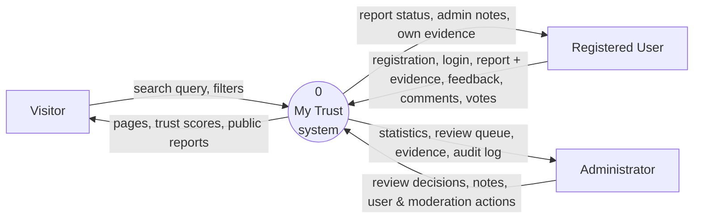
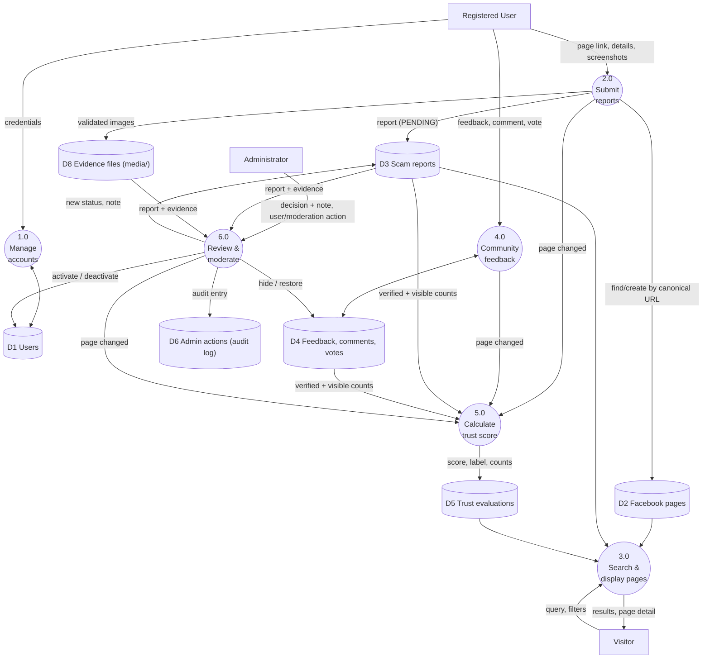

# Data Flow Diagrams

## Level 0 — Context diagram

```mermaid
flowchart LR
    V["Visitor"]
    U["Registered User"]
    A["Administrator"]
    S(("0<br/>My Trust<br/>system"))

    V -- "search query, filters" --> S
    S -- "pages, trust scores, public reports" --> V
    U -- "registration, login, report + evidence, feedback, comments, votes" --> S
    S -- "report status, admin notes, own evidence" --> U
    A -- "review decisions, notes, user & moderation actions" --> S
    S -- "statistics, review queue, evidence, audit log" --> A
```

## Level 1

Processes match the Django apps; data stores are MariaDB tables (D1–D7) and the evidence folder (D8).

```mermaid
flowchart TB
    U["Registered User"]
    V["Visitor"]
    A["Administrator"]

    P1(("1.0<br/>Manage<br/>accounts"))
    P2(("2.0<br/>Submit<br/>reports"))
    P3(("3.0<br/>Search &<br/>display pages"))
    P4(("4.0<br/>Community<br/>feedback"))
    P5(("5.0<br/>Calculate<br/>trust score"))
    P6(("6.0<br/>Review &<br/>moderate"))

    D1[("D1 Users")]
    D2[("D2 Facebook pages")]
    D3[("D3 Scam reports")]
    D4[("D4 Feedback, comments, votes")]
    D5[("D5 Trust evaluations")]
    D6[("D6 Admin actions (audit log)")]
    D8[("D8 Evidence files (media/)")]

    U -- "credentials" --> P1
    P1 <--> D1
    U -- "page link, details, screenshots" --> P2
    P2 -- "find/create by canonical URL" --> D2
    P2 -- "report (PENDING)" --> D3
    P2 -- "validated images" --> D8
    P2 -- "page changed" --> P5
    V -- "query, filters" --> P3
    D2 & D3 & D5 --> P3
    P3 -- "results, page detail" --> V
    U -- "feedback, comment, vote" --> P4
    P4 <--> D4
    P4 -- "page changed" --> P5
    D3 & D4 -- "verified + visible counts" --> P5
    P5 -- "score, label, counts" --> D5
    A -- "decision + note, user/moderation action" --> P6
    D3 & D8 -- "report + evidence" --> P6
    P6 -- "new status, note" --> D3
    P6 -- "hide / restore" --> D4
    P6 -- "activate / deactivate" --> D1
    P6 -- "audit entry" --> D6
    P6 -- "page changed" --> P5
```
