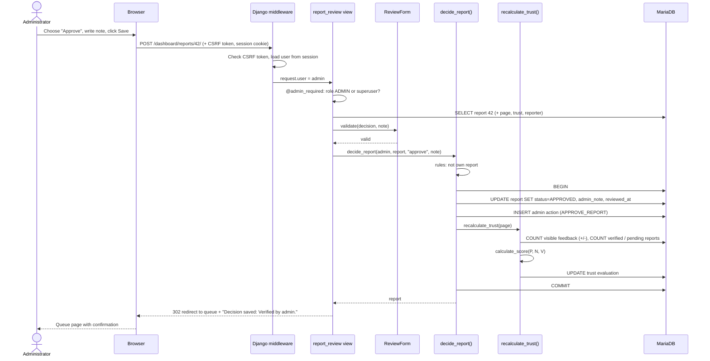
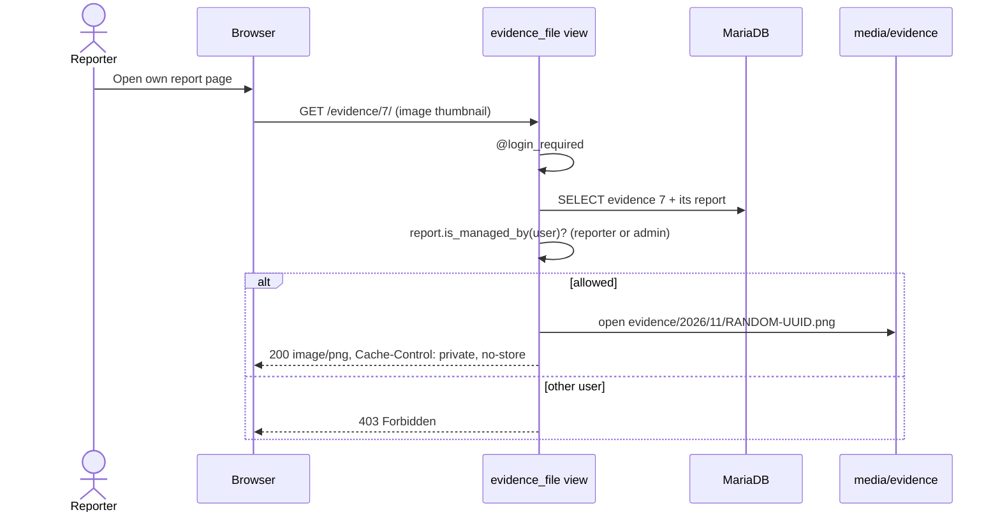

# Sequence Diagrams

## Administrator approves a report

```mermaid
sequenceDiagram
    actor A as Administrator
    participant B as Browser
    participant MW as Django middleware
    participant V as report_review view
    participant F as ReviewForm
    participant S as decide_report()
    participant T as recalculate_trust()
    participant DB as MariaDB

    A->>B: Choose "Approve", write note, click Save
    B->>MW: POST /dashboard/reports/42/ (+ CSRF token, session cookie)
    MW->>MW: Check CSRF token, load user from session
    MW->>V: request.user = admin
    V->>V: @admin_required: role ADMIN or superuser?
    V->>DB: SELECT report 42 (+ page, trust, reporter)
    V->>F: validate(decision, note)
    F-->>V: valid
    V->>S: decide_report(admin, report, "approve", note)
    S->>S: rules: not own report
    S->>DB: BEGIN
    S->>DB: UPDATE report SET status=APPROVED, admin_note, reviewed_at
    S->>DB: INSERT admin action (APPROVE_REPORT)
    S->>T: recalculate_trust(page)
    T->>DB: COUNT visible feedback (+/-), COUNT verified / pending reports
    T->>T: calculate_score(P, N, V)
    T->>DB: UPDATE trust evaluation
    S->>DB: COMMIT
    S-->>V: report
    V-->>B: 302 redirect to queue + "Decision saved: Verified by admin."
    B-->>A: Queue page with confirmation
```

## Reporter views private evidence

```mermaid
sequenceDiagram
    actor R as Reporter
    participant B as Browser
    participant V as evidence_file view
    participant DB as MariaDB
    participant FS as media/evidence

    R->>B: Open own report page
    B->>V: GET /evidence/7/ (image thumbnail)
    V->>V: @login_required
    V->>DB: SELECT evidence 7 + its report
    V->>V: report.is_managed_by(user)? (reporter or admin)
    alt allowed
        V->>FS: open evidence/2026/11/RANDOM-UUID.png
        V-->>B: 200 image/png, Cache-Control: private, no-store
    else other user
        V-->>B: 403 Forbidden
    end
```
